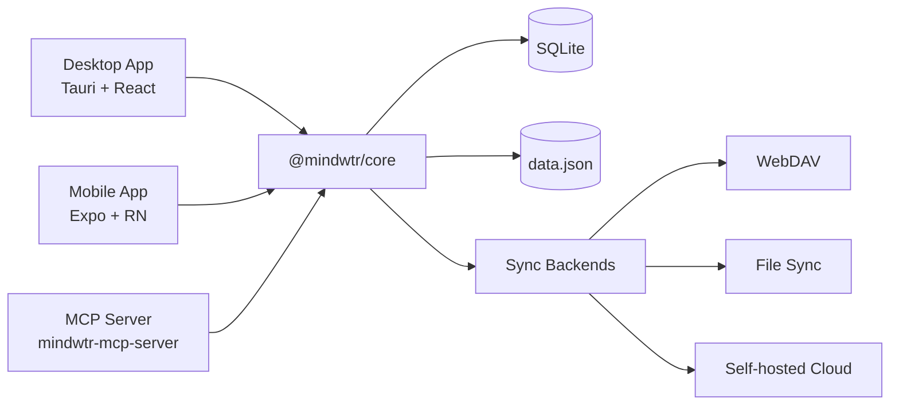

# Architecture

Technical architecture and design decisions for Mindwtr.

---

## Overview

Mindwtr is a cross-platform GTD application with:

- **Desktop app** — Tauri v2 (Rust + React)
- **Mobile app** — React Native + Expo
- **MCP server** — local Model Context Protocol bridge for AI tooling
- **Cloud Sync** — Node.js (Bun) sync server
- **Shared core** — TypeScript business logic package

```
┌─────────────────────────────────────────────────────────┐
│                       User Interface                      │
├─────────────────────────────┬───────────────────────────┤
│      Desktop (Tauri)        │      Mobile (Expo)        │
│   React + Vite + Tailwind   │  React Native + NativeWind│
├─────────────────────────────┴───────────────────────────┤
│                     @mindwtr/core                        │
│ Zustand Store · Types · i18n Loader/Locales · Sync Core │
├─────────────────────────────┬───────────────────────────┤
│    Tauri FS (Rust)          │   SQLite + JSON backup    │
│    SQLite + JSON backup     │     App storage           │
└──────────────┬──────────────┴───────────────────────────┘
               │
┌──────────────▼──────────────┐
│        Cloud / Sync         │
│   WebDAV / Local / Server   │
└─────────────────────────────┘
```

## Design Trade-offs

- **Cloud sync is file-based** and optimized for single-machine self-hosting.
- **SQLite foreign keys are enforced** for live-record integrity, while soft-delete/tombstone repair still happens in shared application logic.
- **Hard deletes are rare but real**. `sections.projectId` uses `ON DELETE CASCADE`, while task/project/area references mostly use `ON DELETE SET NULL`.

### System Diagram (Mermaid)



---

## Monorepo Structure

The project uses a monorepo with Bun workspaces:

```
Mindwtr/
├── apps/
│   ├── cloud/           # Sync server (Bun)
│   ├── desktop/         # Tauri app
│   ├── mcp-server/      # Local MCP server
│   └── mobile/          # Expo app
├── packages/
│   └── core/            # Shared business logic
└── package.json         # Workspace root
```

### Benefits

- Shared code between platforms
- Single version of dependencies
- Unified testing and CI
- Easier refactoring

---

## Core Package (`@mindwtr/core`)

The core package contains all shared business logic:

### Modules

| Module              | Purpose                                       |
| ------------------- | --------------------------------------------- |
| `store.ts`          | Zustand state store with all actions          |
| `types.ts`          | TypeScript interfaces (Task, Project, etc.)   |
| `i18n/i18n-loader.ts` | Lazy translation loading                    |
| `i18n/i18n-translate.ts` | Build-time translation helpers          |
| `i18n/locales/*.ts` | English base locale plus per-language overrides |
| `contexts.ts`       | Preset contexts and tags                      |
| `quick-add.ts`      | Natural language task parser                  |
| `recurrence.ts`     | Recurring task logic (RFC 5545 partial)       |
| `sync.ts` + `sync-*.ts` | Sync orchestration, normalization, signatures, settings merge, and tombstones |
| `date.ts`           | Safe date parsing utilities                   |
| `ai/`               | AI integration (Gemini/OpenAI/Anthropic)      |
| `sqlite-adapter.ts` | Local storage adapter interface               |
| `webdav.ts`         | WebDAV sync client                            |

### Design Principles

1. **Platform agnostic** — No platform-specific code
2. **Storage adapter pattern** — Inject storage at runtime
3. **Pure functions** — Utilities are stateless
4. **Type safety** — Full TypeScript coverage

### State Layering

- **Core store** keeps canonical data (`all tasks/projects`).
- **UI stores** hold view-specific filters and UI state.
- **Visible lists** are derived from core data + UI filters to avoid mixing persistence concerns with presentation.

---

## Desktop Architecture (Tauri)

### Why Tauri?

| Feature      | Tauri  | Electron         |
| ------------ | ------ | ---------------- |
| Binary size  | ~5 MB  | ~150 MB          |
| Memory usage | ~50 MB | ~300 MB          |
| Backend      | Rust   | Node.js          |
| Webview      | System | Bundled Chromium |

### Structure

```
apps/desktop/
├── src/                         # React frontend
│   ├── App.tsx                  # Root component and app shell wiring
│   ├── main.tsx                 # Vite/Tauri webview entry
│   ├── components/
│   │   ├── Task/                # Task form, field, and editor components
│   │   ├── ui/                  # Shared primitive UI components
│   │   └── views/               # Feature views
│   │       ├── agenda/
│   │       ├── calendar/
│   │       ├── inbox/
│   │       ├── list/
│   │       ├── projects/
│   │       ├── review/
│   │       └── settings/
│   ├── config/                  # Desktop app constants/config
│   ├── contexts/                # React contexts
│   ├── hooks/                   # Shared React hooks
│   ├── lib/                     # Desktop services and Tauri bridges
│   ├── store/                   # UI-specific state
│   ├── test/                    # Desktop test utilities
│   └── utils/                   # Small shared utilities
│
├── src-tauri/                  # Rust backend
│   ├── src/main.rs             # Entry point
│   ├── src/platform.rs         # Native commands and path validation
│   ├── capabilities/           # Tauri command/plugin permissions
│   ├── Cargo.toml              # Rust dependencies
│   └── tauri.conf.json         # Tauri config
│
└── package.json
```

### Data Flow

```
User Action → React Component → Zustand Store (@mindwtr/core) → Storage Adapter → SQLite + data.json
```

### Tauri Commands

The Rust backend exposes commands for:
- Allowlisted file opening and attachment/storage operations
- Native dialogs
- System notifications

---

## Mobile Architecture (Expo)

### Why Expo?

- Managed workflow simplifies development
- OTA updates capability
- Expo Router for file-based navigation
- Easy build process (EAS)

### Structure

```
apps/mobile/
├── app/                   # Expo Router pages
│   ├── (drawer)/         # Drawer navigation
│   │   ├── (tabs)/       # Tab navigation
│   │   │   ├── calendar-tab.tsx
│   │   │   ├── capture-quick.tsx
│   │   │   ├── inbox.tsx
│   │   │   ├── focus.tsx
│   │   │   ├── capture.tsx
│   │   │   ├── contexts-tab.tsx
│   │   │   ├── projects.tsx
│   │   │   ├── review-tab.tsx
│   │   │   └── menu.tsx
│   │   ├── calendar.tsx
│   │   ├── contexts.tsx
│   │   ├── saved-search/[id].tsx
│   │   ├── board.tsx
│   │   ├── waiting.tsx
│   │   ├── someday.tsx
│   │   ├── done.tsx
│   │   ├── trash.tsx
│   │   ├── archived.tsx
│   │   ├── reference.tsx
│   │   ├── projects-screen.tsx
│   │   └── settings.tsx
│   └── _layout.tsx       # Root layout
│
├── components/           # Shared components
├── contexts/             # Theme, Language
├── lib/                  # Storage, sync utilities
└── package.json
```

### Navigation

```
Drawer/Stack Layout
├── Tab Navigator
│   ├── Inbox
│   ├── Agenda
│   ├── Next Actions
│   ├── Projects
│   └── Menu (links to other views)
├── Other Screens (Stack)
│   ├── Board
│   ├── Calendar
│   ├── Review
│   ├── Contexts
│   ├── Waiting For
│   ├── Someday/Maybe
│   ├── Archived
│   └── Settings
```

---

## State Management

### Zustand Store

The central store (`@mindwtr/core/src/store.ts`) manages all application state:

```typescript
interface TaskStore {
    tasks: Task[];
    projects: Project[];
    areas: Area[];
    settings: AppData['settings'];
    
    // Actions
    fetchData: () => Promise<void>;
    addTask: (title: string, props?: Partial<Task>) => Promise<void>;
    updateTask: (id: string, updates: Partial<Task>) => Promise<void>;
    deleteTask: (id: string) => Promise<void>;
    // ... projects, areas, and settings actions
}
```

### Storage Adapter Pattern

The store uses injected storage adapters:

```typescript
// Desktop: Tauri file system
setStorageAdapter(tauriStorage);

// Mobile: SQLite (with JSON backup fallback)
setStorageAdapter(mobileStorage);
```

### Persistence

- **Write coalescing** — Changes are enqueued immediately and overlapping writes are coalesced into the next flush
- **Flush on exit** — Pending saves are flushed when app backgrounds
- **Soft deletes** — Items are marked with `deletedAt` for sync

---

## Data Model

The canonical type surface lives in [[Core API]] and `packages/core/src/types.ts`.

- Use [[Core API]] for current field-level docs for `Task`, `Project`, `Section`, `Area`, `Attachment`, and `AppData`.
- Sync-sensitive fields such as `rev`, `revBy`, `purgedAt`, `orderNum`, `mimeType`, `size`, `cloudKey`, and `localStatus` evolve more often than this architecture overview.
- Keeping the detailed type dump in one page avoids architecture docs drifting from the code.

---

## Sync Strategy

### Revision-Aware LWW with Tombstones

Data synchronization relies on revision-aware last-write-wins with deterministic tie-breaks.

### Merge Logic

1. **Resolution**:
    - If both sides have revisions, higher `rev` wins before timestamp tie-breaks.
    - If revisions tie, compare `updatedAt`.
    - If timestamps still tie, compare deterministic normalized content signatures so every device picks the same winner.
2. **Tombstones**:
    - Deleted items retain their record with `deletedAt` set.
    - Prevents resurrection on sync.
    - Allows proper merge across devices.
    - Delete-vs-live conflicts use operation time (`max(updatedAt, deletedAt)` for tombstones).
    - If delete-vs-live operations land within the 30-second ambiguity window, Mindwtr preserves the live item instead of eagerly deleting it.
3. **Conflicts**:
    - Metadata-level conflicts are resolved automatically.
    - Settings merge by sync groups (`appearance`, `language`, `gtd`, `externalCalendars`, `ai`, `savedFilters`) rather than one giant object timestamp.
    - Large clock skew warnings fire when merge drift exceeds the current 5-minute threshold.

### Sync Cycle

```
1. Read Local Data
2. Read Remote Data (Cloud/WebDAV/File)
3. Merge (Memory) -> Generate Stats (conflicts, updates)
4. Write Local with pending-remote-write marker
5. Write Remote
6. Clear pending-remote-write marker locally
```

If remote write fails after local persistence, Mindwtr stores retry metadata and backs off from 5 seconds up to 5 minutes before retrying.

### Snapshot Transport

Mindwtr sync currently transports full snapshots on purpose. This is not a placeholder for a missing delta system.

- ADR 0003 and ADR 0007 define the revision-aware merge rules that operate on those snapshots.
- ADR 0008 records the current transport decision: keep snapshot merge and do not add a delta log yet.
- For current personal GTD workloads, snapshot sync keeps the implementation simpler, preserves full-file atomicity, and avoids extra replay and compaction state.
- If this changes later, the delta design should extend the existing `rev` and `revBy` model rather than replacing it with a new sequence system.

The delta-log decision should be revisited only if snapshot files regularly exceed 5 MB, sync round-trips exceed 5 seconds on typical networks, or the product needs real-time multi-device streaming.

Testing coverage and release gates are tracked separately in [[Testing Strategy]] so this page can stay focused on runtime architecture.

---

## Internationalization

### Structure

Translations are split across the `packages/core/src/i18n/` folder:

```typescript
// packages/core/src/i18n/i18n-loader.ts
// packages/core/src/i18n/i18n-translations.ts
// packages/core/src/i18n/locales/*.ts
```

### Usage

Each app has a language context that provides a `t()` function.
