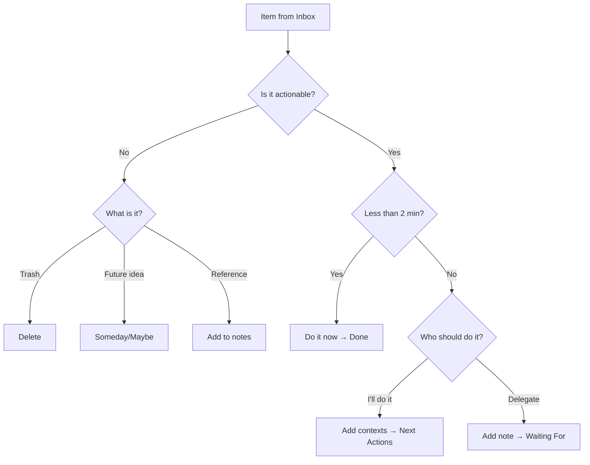

# GTD Workflow in Mindwtr

This guide shows how to implement the GTD methodology using Mindwtr's features.

---

## Overview

Mindwtr maps directly to GTD concepts:

| GTD Concept   | Mindwtr Feature                        |
| ------------- | -------------------------------------- |
| Inbox         | Inbox view                             |
| Clarify       | Processing wizard                      |
| Next Actions  | Focus view for available actions; Contexts/Projects/Search for full inventory |
| Projects      | Projects view                          |
| Waiting For   | Waiting For view (status: `waiting`)   |
| Someday/Maybe | Someday/Maybe view (status: `someday`) |
| Calendar      | Calendar view (tasks with due dates)   |
| Weekly Review | Review wizard                          |

---

## Patterns

Use these patterns to keep the system light:

- Write next actions as visible physical steps: "Call insurance" beats "Handle insurance."
- Keep project support material in project notes. Do not flood Focus with future actions that cannot be done yet.
- Break large tasks into chunks or time boxes, such as "Spend 30 minutes sorting photos."
- Use contexts for tools, places, energy, and people: `@phone`, `@errands`, `#focused`, `@Alex`.
- Put delegated work in Waiting For with a follow-up date or person context.
- Keep the calendar for hard landscape: appointments, deadlines, and time-specific commitments.
- During Weekly Review, promote future project notes into real next actions when they become available.
- Choose one next action per project for a lean system, or multiple only when they are truly parallel.

---

## 1. Capture (Inbox)

### Quick Capture

- **Desktop:** Type in the bottom input field or use keyboard shortcut `o`
- **Mobile:** Tap the input field on the Inbox tab
- **Mind Sweep:** Use guided prompts when you need to collect open loops across work, home, people, errands, and someday ideas.

### Quick-Add Syntax

Capture with context immediately:
```
Call plumber @phone @home
Buy groceries @errands /due:saturday
Research topic #focused +WorkProject
```

### The Rule

Capture everything. Don't filter, judge, or organize—just get it out of your head.

---

## 2. Clarify (Processing Wizard)

### Starting the Process

- **Desktop:** Click "Process Inbox" button
- **Mobile:** Tap "Process Inbox" button

### The Workflow



### Decision Points

**Is it actionable?**
- No → Delete, move to Someday/Maybe, or add as reference
- Yes → Continue

**Will it take less than 2 minutes?**
- Yes → Do it immediately, mark Done
- No → Continue

**Who should do it?**
- I'll do it → Select contexts, move to Next Actions
- Delegate → Add waiting note, move to Waiting For

**Assign a project?** (Optional)
- Link related tasks to a project

---

## 3. Organize

### Task Statuses

| Status     | Meaning            | View          |
| ---------- | ------------------ | ------------- |
| `inbox`    | Not yet processed  | Inbox         |
| `next`     | Ready to do next   | Focus         |
| `waiting`  | Delegated/blocked  | Waiting For   |
| `someday`  | Future/maybe       | Someday/Maybe |
| `done`     | Recently completed | Done          |
| `archived` | Completed and filed away | Archived      |

Done and Archived are both closed states, but they serve different jobs:

- **Done** is the recent completion log. Use it for tasks you may want to see during daily or weekly review.
- **Archived** is filed history. Archived tasks are hidden from normal task lists, but stay available in the Archived view for search, restore, or permanent deletion.
- **Auto-Archive** can move Done tasks to Archived after a set number of days. Set it to **Never** if you want Done to keep all completed tasks indefinitely.

### Contexts and Tags

Add contexts to filter by where you can do tasks:

**Location contexts (@):**
- `@home`, `@work`, `@errands`, `@anywhere`
- `@computer`, `@phone`, `@agendas`

**Tags (#):**
- `#focused` — Deep work
- `#lowenergy` — Simple tasks
- `#creative` — Brainstorming
- `#routine` — Repetitive tasks

### People

Use People for delegated or person-centered work. A task's assignee powers Waiting For lists, suggestions, and `assigned:` search; the People manager lets you keep reusable names, notes, and reference links without turning every person into a context tag.

### Projects

Create projects for multi-step outcomes:

1. Go to Projects view
2. Add a new project with name and color
3. Add tasks to the project
4. (Optional) Create **Sections** to group tasks by phase or sub‑outcome
5. Toggle Sequential/Parallel mode:
   - **Sequential:** Only first task shows in Focus view
   - **Parallel:** All tasks show in Focus view

#### Project Sections

Project Sections are subdivisions inside a single project. Use them when a project has natural phases, milestones, or workstreams and a flat task list would be hard to scan.

Example: **Launch website** can have sections such as **Design**, **Development**, and **Content**. These are not separate projects and not subtasks. They are organizational headings inside one project outcome.

The **Project Section** field on a task assigns that task to one of its project's sections. It is useful only after the task belongs to a project that has sections. For unassigned tasks, or projects without sections, leave the field blank.

Sequential projects can use a project-wide scope or a section scope. Use section scope when a project has independent phases or workstreams: Mindwtr shows the first available task in each section instead of blocking the whole project behind one task.

### Due Dates and Reminders

- Set **due date** for deadlines
- Set **start date** for when to begin
- Set **review date** (tickler) for periodic check-ins

### Dates vs. Status

Mindwtr keeps task status and task dates separate. Status is the GTD state you choose, such as `inbox`, `next`, `waiting`, or `someday`. Dates control when and why a task appears; they do not automatically promote a task to `next`.

- **Start date** is a defer/availability gate. A future start hides the task from Focus by default. When the start date arrives, the task becomes visible according to its existing status.
- **Review date** is a tickler. When due, it surfaces a non-inbox task for reconsideration without changing its status.
- **Due date** is a deadline. It drives deadline display, reminders, and sorting pressure without changing status.

Some processing actions set status and dates together. For example, choosing **Later** while processing the Inbox moves the item to `next` and sets a start date. That action changes the status; the start date does not promote the task later on its own.

---

## 4. Reflect (Weekly Review)

### Starting the Review

- **Desktop:** Go to Weekly Review in sidebar
- **Mobile:** Tap the Review tab in the bottom bar

### The Steps

1. **Process Inbox**
   - Clear all inbox items
   - Goal: Inbox Zero
   - Use the review's Process Inbox action to run the normal clarify workflow from inside Weekly Review

2. **Review Calendar**
   - Look back 2 weeks for missed follow-ups
   - Look ahead 2 weeks for preparation needs

3. **Waiting For**
   - Review delegated items
   - Send reminders if needed

4. **Review Projects**
   - Ensure each project has a next action
   - Mark completed projects as done

5. **Someday/Maybe**
   - Review incubated ideas
   - Activate or delete items

### Best Practice

Schedule 30-90 minutes weekly, same time, same place.

---

### Engage

### Choosing What to Work On

Use the **Focus** view to see:
- Today's focused tasks (starred items)
- Next Actions (context-filtered or general)
- Overdue items
- Due today

Focus is not a full inventory view. It hides future-start tasks and later tasks in sequential projects so the list reflects actions that are available now. Use **Contexts**, **Projects**, or **Search** when you need to inspect all next actions, including deferred or blocked items.

### How Focus sorts available actions

Focus first decides whether a task is available, then sorts the visible actions:

1. **Today's Focus** shows tasks you explicitly focused for today.
2. **Today / Schedule** shows available `next` tasks that are overdue, due today, or start today. These are ordered by the earliest due/start time, then priority when priorities are enabled, then oldest creation date.
3. **Next Actions** shows the remaining available `next` tasks. The default order is:
   - due soon first, earliest due date first (currently due within the next 30 days)
   - undated actions next
   - far-future due actions last, earliest due date first
   - within the same bucket: priority when enabled, then start time, oldest creation date, title, and id
4. **Review Due** shows tasks whose review date is due.

Start date is Mindwtr's defer/planned-date field. Future-start tasks are hidden from Focus by default unless you enable future-start visibility. Sequential projects also limit Focus to the first available action for that project or section, so later actions stay out of Focus until the previous step is no longer blocking them.

Time estimate and energy are Focus filters and grouping options, not default sort keys. Grouping by context, project, area, energy, or priority changes the visual groups; tasks inside those groups keep the same availability and next-action ordering.

### Context Filtering

1. Go to **Focus** or **Contexts** view
2. Select a context chip (e.g., @home)
3. See only tasks for that context

### Today's Focus

Star tasks as today's priorities up to your configured Focus limit:
- **Desktop:** Click the star icon
- **Mobile:** Tap the star badge

---

## Daily Workflow

### Morning

1. Open **Focus** view to see today's priorities
2. Set focus tasks for the day up to your configured Focus limit
3. Start working on the first one (mark as Focus)

### Throughout the Day

1. Capture new items to Inbox
2. Check context-filtered lists when switching locations
3. Mark completed tasks as Done

### End of Day

1. Quick scan of Inbox (process if time)
2. Review tomorrow's calendar
3. Update any in-progress tasks

---

## Recurring Tasks

Set up recurring tasks for habits and repeating responsibilities:

1. Edit a task
2. Set recurrence (daily, weekly, monthly, yearly)
3. Choose strategy:
   - **Strict** for fixed schedules, such as a monthly review that should stay on the planned day
   - **Repeat after completion** for habits based on when you actually finish
4. When completed, a new instance is created automatically

Mindwtr keeps one active instance of a recurring task. Future occurrences are not pre-populated in the Calendar; the next instance appears only after you complete the current one. This keeps overdue work visible instead of quietly creating a chain of future copies.

**Example recurring tasks:**
- Weekly: "Review project status"
- Daily: "Check email @computer"
- Monthly: "Review subscriptions"

---

## Tips for Success

### Trust Your System

- Capture everything immediately
- Process regularly
- Don't skip weekly reviews

### Keep It Simple

- Don't over-organize
- Use contexts sparingly at first
- Add complexity only when needed

### Build Habits

- Same time for weekly review
- Regular inbox processing
- Consistent capture method

---

## See Also

- [[GTD Overview]]
- [[Contexts and Tags]]
- [[Weekly Review]]
